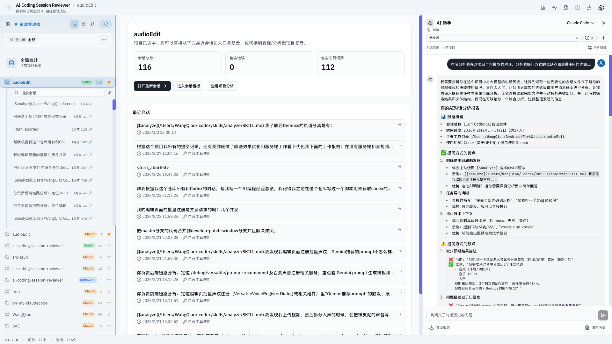

<div align="center">

# AI Coding Session Reviewer

**浏览、搜索和分析您的 Claude Code 对话记录 — 完全离线。**

读取 Claude Code、Codex CLI 和 OpenCode 对话历史的桌面应用,支持数据分析、会话面板和实时监控。

[](https://github.com/materialofair/ai-coding-session-reviewer/releases)
[](https://github.com/materialofair/ai-coding-session-reviewer/stargazers)
[](LICENSE)
[](https://github.com/materialofair/ai-coding-session-reviewer/actions/workflows/rust-tests.yml)
[](https://github.com/materialofair/ai-coding-session-reviewer/commits/main)

[官网](https://github.com/materialofair/ai-coding-session-reviewer) · [下载](https://github.com/materialofair/ai-coding-session-reviewer/releases) · [报告问题](https://github.com/materialofair/ai-coding-session-reviewer/issues)

**Languages**: [English](README.md) | [한국어](README.ko.md) | [日本語](README.ja.md) | [中文 (简体)](README.zh-CN.md) | [中文 (繁體)](README.zh-TW.md)

</div>


---

## 快速预览

一图了解核心流程：项目级复盘、多会话导航、AI 助手分析在同一界面完成。



## 目录

- [功能特性](#功能特性)
- [安装](#安装)
- [从源码构建](#从源码构建)
- [使用方法](#使用方法)
- [无障碍支持](#无障碍支持)
- [技术栈](#技术栈)
- [数据隐私](#数据隐私)
- [常见问题](#常见问题)
- [贡献](#贡献)
- [致谢](#致谢)
- [许可证](#许可证)

## 功能特性

| 功能 | 描述 |
|---------|-------------|
| **多提供商** | 统一查看 Claude Code、Codex CLI 和 OpenCode 对话 |
| **AI 助手** | 内置助手可解释会话、总结对话，并回答项目级问题 |
| **对话浏览器** | 按项目/会话导航对话,支持工作树分组 |
| **全局搜索** | 即时搜索所有对话内容 |
| **分析仪表板** | 双模式 Token 统计（计费 vs 对话）、成本明细、提供商分布图表 |
| **会话面板** | 多会话可视化分析,支持像素视图、属性筛选和活动时间线 |
| **设置管理器** | 作用域感知的 Claude Code 设置编辑器,支持 MCP 服务器管理 |
| **消息导航器** | 右侧可折叠目录,快速浏览对话内容 |
| **实时监控** | 实时监听会话文件变化并即时更新 |
| **会话上下文菜单** | 复制会话 ID、恢复命令和文件路径;原生重命名集成搜索 |
| **ANSI 颜色渲染** | 以原始 ANSI 颜色显示终端输出 |
| **多语言** | 英语、韩语、日语、简体中文、繁体中文 |
| **最近编辑** | 查看文件修改历史并恢复 |
| **自动更新** | 内置更新器,支持跳过/延迟选项 |

## 安装

下载适合您平台的最新版本:

| 平台 | 下载 |
|----------|----------|
| macOS (通用) | [`.dmg`](https://github.com/materialofair/ai-coding-session-reviewer/releases/latest/download/AI.Coding.Session.Reviewer_1.5.3_universal.dmg) |

### Homebrew (macOS)

```bash
brew tap jhlee0409/tap
brew install --cask ai-coding-session-reviewer
```

或者使用完整 Cask 路径直接安装:

```bash
brew install --cask materialofair/tap/ai-coding-session-reviewer
```

如果出现 `No Cask with this name exists`，请使用上面的完整路径命令。

升级:

```bash
brew upgrade --cask ai-coding-session-reviewer
```

卸载:

```bash
brew uninstall --cask ai-coding-session-reviewer
```

> **从手动安装(.dmg)迁移？**
> 为避免冲突，请先删除现有应用，然后通过 Homebrew 安装。
> 请只使用**一种**安装方式 — 不要混合使用手动安装和 Homebrew。
> ```bash
> # 先删除手动安装的应用
> rm -rf "/Applications/AI Coding Session Reviewer.app"
> # 通过 Homebrew 安装
> brew tap jhlee0409/tap
> brew install --cask ai-coding-session-reviewer
> ```

## 从源码构建

```bash
git clone https://github.com/materialofair/ai-coding-session-reviewer.git
cd ai-coding-session-reviewer

# 方式 1: 使用 just (推荐)
brew install just    # 或: cargo install just
just setup
just dev             # 开发模式
just tauri-build     # 生产构建

# 方式 2: 直接使用 pnpm
pnpm install
pnpm tauri:dev       # 开发模式
pnpm tauri:build     # 生产构建
```

**系统要求**: Node.js 18+, pnpm, Rust 工具链

## 使用方法

1. 启动应用
2. 自动扫描所有支持的提供商 (Claude Code、Codex CLI、OpenCode) 的对话数据
3. 在左侧边栏浏览项目 — 使用标签栏按提供商筛选
4. 点击会话查看消息
5. 使用标签页在消息、分析、Token 统计、最近编辑和会话面板之间切换

## 无障碍支持

应用提供键盘优先、低视力和屏幕阅读器友好的无障碍能力。

- 键盘导航：支持项目树、消息导航器与跳转链接
- 视觉辅助：全局字体缩放与高对比度模式
- 屏幕阅读器：语义化区域、状态播报与辅助描述

## 技术栈

| 层级 | 技术 |
|-------|------------|
| **后端** |   |
| **前端** |    |
| **状态管理** |  |
| **构建工具** |  |
| **国际化** |  5 种语言 |

## 数据隐私

**100% 离线运行。** 不会将任何对话数据发送到任何服务器。无分析、无跟踪、无遥测。

您的数据保留在您的设备上。

## 常见问题

| 问题 | 解决方案 |
|---------|----------|
| "未找到 Claude 数据" | 确保 `~/.claude` 目录存在且包含对话历史 |
| 性能问题 | 大量历史记录初次加载可能较慢 — 应用使用虚拟滚动优化性能 |
| 更新问题 | 如果自动更新失败,请从 [Releases](https://github.com/materialofair/ai-coding-session-reviewer/releases) 手动下载 |

## 贡献

欢迎贡献! 以下是入门指南:

1. Fork 本仓库
2. 创建功能分支 (`git checkout -b feat/my-feature`)
3. 提交前运行检查:
   ```bash
   pnpm tsc --build .        # TypeScript
   pnpm vitest run            # 测试
   pnpm lint                  # 代码检查
   ```
4. 提交更改 (`git commit -m 'feat: add my feature'`)
5. 推送到分支 (`git push origin feat/my-feature`)
6. 创建 Pull Request

查看 [开发命令](CLAUDE.md#development-commands) 了解完整的可用命令列表。

## 致谢

特别感谢 [claude-code-history-viewer](https://github.com/jhlee0409/claude-code-history-viewer) 提供的最初灵感与基础。

## 许可证

[MIT](LICENSE) — 免费用于个人和商业用途。

---

<div align="center">

[](https://star-history.com/#materialofair/ai-coding-session-reviewer&Date)

</div>
